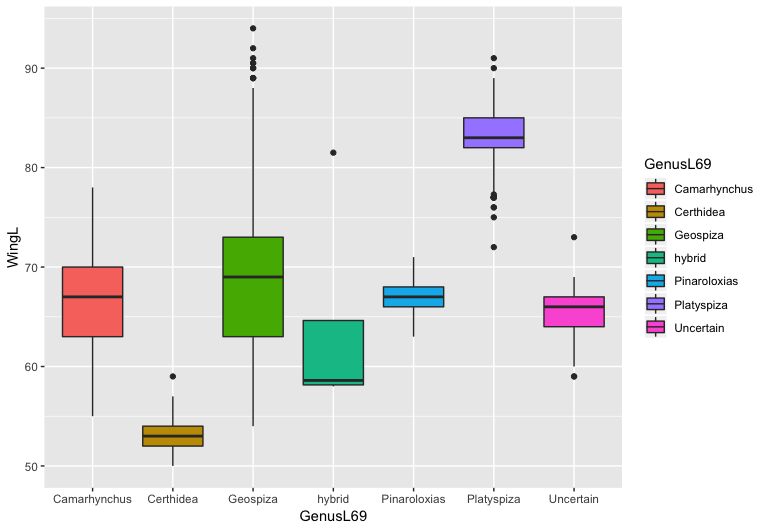

Exercise 2 - Initial visualization
----------------------------------

The box plot below shows wing length data for each of the 5 finch genera
included in the Sato dataset. If you haven’t worked with this kind of
graph before you can [learn more about box plots
here](http://vita.had.co.nz/papers/boxplots.pdf).

